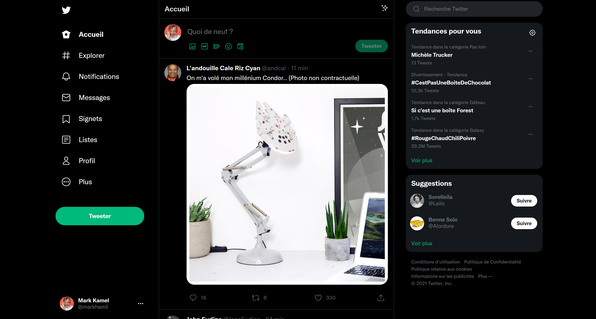

# Twitter Copy



## Summary

- **Genesis :** School Project
- **Technology**
- **Global Structure**
- **Responsive**
- **JavaScript**
- **What did we learn ?**

### Genesis : School project

As part of a school project, we had to recreate the Twitter home page.

This project consisted in recreating the page using HTML5 and CSS3. I allowed myself to add elements in JavaScript.

Enjoy seeking the code !

### Technology

For this project, we had to use various tools. Here are those I personnaly used for my website:
#### HTML5

Our HTML file is a fundamental here because it's like the body of our project. It allows us to define a skeleton for our website, to declare the numerous elements inside of it.  

#### CSS3

In the assets folder you can see our stylesheet `styles.css`. It is really useful because it allows us to style every single element that we declared earlier. If the html file is our skeleton, this stylesheet is its skin.

#### Font Awesome

Now, this skin must be enriched with some original visuals such as beautiful icons, and Font Awesome is really great at this job because it delivers almost endless possibilities for our icons, even more if you own the pro version. (but for this project this is not my case) 

#### JavaScript

Javascript is really helpful at making our elements more dynamic, it's an awesome tool to use for our website because a body is nothing if it's only flesh and bones ! If we want to compare our webpage to the human body once more, let's say that it ensure the role of muscles and nervous system. The true complexity of this website comes with javascript: without it, your page is nothing else than pure visuals. In other words, smoke and mirrors!   


### Global Structure : Designing our website

I decided to use a flexbox with the property display:flex for my body in order to easily divide my website into two horizontal parts:
- **header** (the navigation, to the left)
- **main**, divided in two other parts :
    - **feed** (in the middle with the tweets)
    - **aside** (to the right with the suggests)

```html
<body>
    <header>
        <nav>...</nav>
    </header>
    <main>
        <div class="feed">...</div>
        <div class="aside">...</div>
    </main>
</body>
```
Now, only the main part must be scrolled. According to this, I decided for the header and aside part to create a child section taking 100% of the height and width of the column, and to make it fixed by using `position:fixed` property so it can't be scrolled anymore. 

### Responsive

I decided to cut the responsive in 4 parts :
1. Wider than **1282px** : Everything is visible.
2. Thinner than **1282px** : Hide the text from the navigation part.
3. Thinner than **1094px** : Make the aside part responsive
    The width isn't fix anymore.
4. Thinner than **1025px** : Hide the aside part, and make the feed side fit the screen.

### JavaScript

As said before, I allowed myself to add 2 elements in JavaScript. 
The first one is an auto-sized `<textarea>`, and the second is a "Tweeter" button than is only active if the `<textarea>` tag isn't empty.

```html
<script>
    // I get the textArea Element by his tag name
    const tx = document.getElementsByTagName("textarea");
    // And I get the Tweet Button by his Id
    const tweet = document.getElementById("tweet-button");
    
    // I create a for loop all the textarea (in case I add an other Tweet textArea)
    for (let i = 0; i < tx.length; i++) {

        // I add the attribute min-height, and hide the overflow
        tx[i].setAttribute("style", "min-height:" + (tx[i].scrollHeight) + "px;overflow-y:hidden;");
        
        // I add an event listener. When the user type something in the textArea, it trigger the OnInput() function
        tx[i].addEventListener("input", OnInput, false);
    }

    // The Function triggered when the user type in the textArea
    function OnInput() {
        
        // I set the minHeight to auto, to prevent an error in the next line
        this.style.minHeight = "auto";
        
        // I get the scrollHeight of the element, and set it to the minHeight
        this.style.minHeight = (this.scrollHeight) + "px";

        // If the textArea has text in it...
        if (this.value.length > 0) {
            
            // ... the class active is added to the Tweet Button ...
            $("#tweet-button").addClass("active")
        } else {
            // ... however, it remove the class
            $("#tweet-button").removeClass("active")
        }
    }
</script>
```

### What did we learn ?

This project gave me the opportunity to consolidate my knowledge in HTML, and develop my skills in CSS and more particularly responsive.

I was also able to try Javascript, which really gave my project a nice addition.

A true thanks for reading our ReadMe.md

### Credits

[LouisRvlE](https://github.com/LouisRvlE) : Louis Réville
[Kimiruu](https://github.com/Kimiruu) : Kiara Drouin
[K4mlna](https://github.com/K4mlna) : Tawan-François Asselain